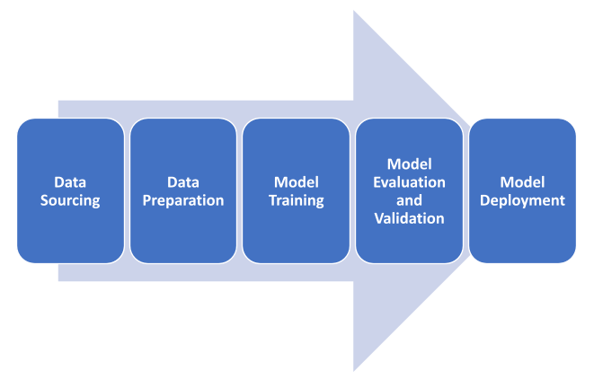
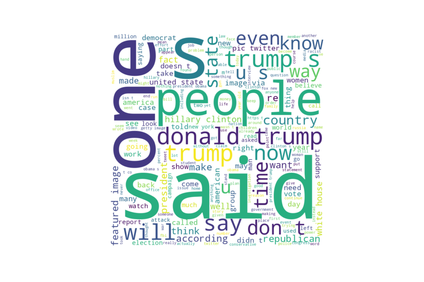
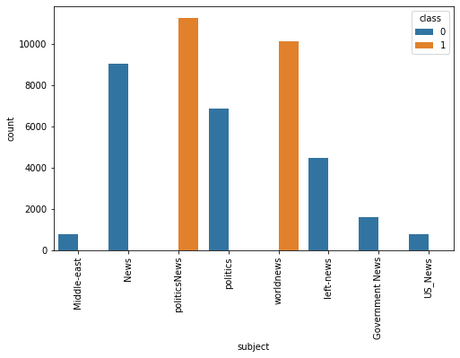
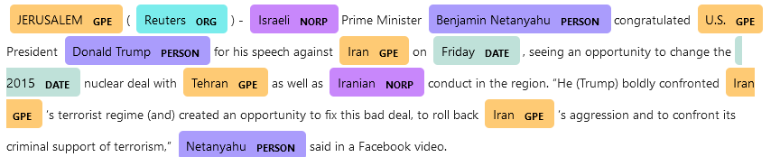

<div class="cell markdown">

# Project Title:

### Fake News Classification Web app

 

*by Team APACHE*

</div>

<div class="cell markdown">

## Problem Brief

**Fake News A Real Problem** - *The plague eating up social media*

The destructive and catastrophic import of fake news can not be
overemphasis and utterly underestimated, Though fake news start subtle
and goes unnoticeable in the early stages, but when allow to breed,
birth violent outcomes which is capable of instigating social, political
wars, and capable of causing psychological effect on individuals
targeted at, especially today, amid a pandemic, social media platforms
are being used to dish out misinformation at lightning speed. One thing
we can do is to avoid news altogether which seems nearly impossible or
one can utilize tools such as those of machine learning to fight the
fatigue of fake new - **This is the intent of this project**

## Project Scope And Boundary

  - Kaggle fake news twitter dataset was used for this analysis. link
    [fake\_news\_dataset](https://www.kaggle.com/clmentbisaillon/fake-and-real-news-dataset)
  - The news niche focus on polical news in the united states
  - The news article examined in the dataset is 2 years old.

</div>

<div class="cell markdown">

## Project Aim

The objective of this article is to outline end-to-end steps on building
and training a machine learning model model to classify fake and true
news using the best performing algorithm and deploying this model using
Streamlit.</br>

The dataset source is from Kaggle : Fake News dataset from the InClass
Prediction Competition.</br> All notebooks and scripts used can be found
on apache GitHub repo
[apache-21](https://github.com/apache-21/fake_news_detection). This
article will illustrate 7 steps which are outline in the project
workflow section.

</div>

<div class="cell markdown" id="2C3D0IlEKAQt">

## Project Workflow :



1.  Data Source : Data gotten from kaggle.com
2.  Data Preprocessing of text
      - a. Exploratory Data Analysis
      - b. Data cleaning and feature engineering
      - c. Visualization
3.  Model Selection and Evaluation
4.  Data Pipeline
5.  Model Deployment
6.  Consolidation and Discussion

</div>

<div class="cell markdown" id="5ehL3zMgMy7F">

### Data Preprocessing

#### Library use for project development:

  - Pandas for data analysis

  - numpy for numerical computation

  - matplotlib for visualisation

  - spacy for information extraction to perform such as (NER, POS
    tagging, dependency parsing, word vectors

  - nltk for text preprocessing, converting text into numbers for the
    model.

  - Seaborn for visualization

  - textblob for text preprocessing, such as part-of-speech tagging,
    noun phrase extraction, sentiment analysis, classification,
    translation

  - re library for to search and find patterns in the tweets

  - wordcloud which is a visualization technique for text data wherein
    each word is picturized with its importance in the context or its
    frequency.

  - pickle to save the model and acess it

</div>

<div class="cell markdown">

### Project Methodology

#### Preparing the dataset

The dataset from Kaggle is provided in 2 CSV files which are already
classified between true and fake news. The dataset was loaded using the
pandas library however since it is textual data we carried out data
cleaning, pre-processing, EDA and model-building operations.

Below is an overview of the dataset

</div>

<div class="cell code" data-execution_count="6">

``` python
fake_news = pd.read_csv('Fake.csv')
fake_news.head()
```

<div class="output execute_result" data-execution_count="6">

``` 
                                               title  \
0   Donald Trump Sends Out Embarrassing New Year’...   
1   Drunk Bragging Trump Staffer Started Russian ...   
2   Sheriff David Clarke Becomes An Internet Joke...   
3   Trump Is So Obsessed He Even Has Obama’s Name...   
4   Pope Francis Just Called Out Donald Trump Dur...   

                                                text subject  \
0  Donald Trump just couldn t wish all Americans ...    News   
1  House Intelligence Committee Chairman Devin Nu...    News   
2  On Friday, it was revealed that former Milwauk...    News   
3  On Christmas day, Donald Trump announced that ...    News   
4  Pope Francis used his annual Christmas Day mes...    News   

                date  
0  December 31, 2017  
1  December 31, 2017  
2  December 30, 2017  
3  December 29, 2017  
4  December 25, 2017  
```

</div>

</div>

<div class="cell code" data-execution_count="7" data-execution="{&quot;shell.execute_reply&quot;:&quot;2021-11-09T21:30:13.675880Z&quot;,&quot;shell.execute_reply.started&quot;:&quot;2021-11-09T21:30:13.644952Z&quot;,&quot;iopub.execute_input&quot;:&quot;2021-11-09T21:30:13.644986Z&quot;,&quot;iopub.status.idle&quot;:&quot;2021-11-09T21:30:13.676573Z&quot;,&quot;iopub.status.busy&quot;:&quot;2021-11-09T21:30:13.644746Z&quot;}" id="gXnJ6FnPFUci" data-outputId="52041b19-0354-464a-d6f8-9be30c9a7917">

``` python
fake_news.info()
```

<div class="output stream stdout">

    <class 'pandas.core.frame.DataFrame'>
    RangeIndex: 23481 entries, 0 to 23480
    Data columns (total 4 columns):
     #   Column   Non-Null Count  Dtype 
    ---  ------   --------------  ----- 
     0   title    23481 non-null  object
     1   text     23481 non-null  object
     2   subject  23481 non-null  object
     3   date     23481 non-null  object
    dtypes: object(4)
    memory usage: 733.9+ KB

</div>

</div>

<div class="cell markdown">

The dataset was examine for missing values, and it is interesting that
there are no missing values</br> we have a dataset of 4 features and
23481 observation

More so, upon examining the dataset, it is observe that there are some
words present in the data which are irrelavant to the model, and as
result we use reqular expression to get such unwanted patterns of text
in the data and this is utilize in a function to search and find such
words and phrase which is then filter it from the dataset.

</div>

<div class="cell markdown" data-execution="{&quot;shell.execute_reply&quot;:&quot;2021-11-09T21:30:13.684326Z&quot;,&quot;shell.execute_reply.started&quot;:&quot;2021-11-09T21:30:13.679738Z&quot;,&quot;iopub.execute_input&quot;:&quot;2021-11-09T21:30:13.679774Z&quot;,&quot;iopub.status.idle&quot;:&quot;2021-11-09T21:30:13.685161Z&quot;,&quot;iopub.status.busy&quot;:&quot;2021-11-09T21:30:13.679494Z&quot;}" id="XRDPe5d5MBaG">

The re.sub() function is used to replace occurrences of a particular
sub-string with another sub-string.<br>

def operate\_on\_word(text): <br>     text = re.sub('\\w*\\d\\w*',
'',<br>        re.sub('\\n', '',<br>          re.sub('\[%s\]' %
re.escape(string.punctuation), '', <br>               re.sub('\<.*?\>+',
'', <br>                 re.sub('https?://\\S+|www.\\S+', '', <br>   
               re.sub("\\W", ' ', <br>                    
  re.sub('\[.*?\]', '', text.lower())))))))<br> return text

</div>

<div class="cell code" data-execution_count="7" data-execution="{&quot;shell.execute_reply&quot;:&quot;2021-11-09T21:30:31.168462Z&quot;,&quot;shell.execute_reply.started&quot;:&quot;2021-11-09T21:30:13.687512Z&quot;,&quot;iopub.execute_input&quot;:&quot;2021-11-09T21:30:13.687549Z&quot;,&quot;iopub.status.idle&quot;:&quot;2021-11-09T21:30:31.169119Z&quot;,&quot;iopub.status.busy&quot;:&quot;2021-11-09T21:30:13.686977Z&quot;}" id="0ekZYKiNJyh1" data-outputId="8ce21455-c2c2-4fc4-f276-c9c4ebbfb8ca">

``` python
# fake_corpus - patterns filter using the helper function 
fake_corpus = ' '.join(fake_news.text.apply(operate_on_word))

len(fake_corpus)
```

<div class="output execute_result" data-execution_count="7">

    59145324

</div>

</div>

<div class="cell markdown">

### Generating the WordCloud from the preprocess dataset

WordCloud : is a visualization technique for text data wherein each word
is picturized with its importance in the context or its frequency.
However to generate the wordcloud there is a need to define stopwords.

In this entire process of generating a word cloud or processing any text
data, we will always have a set of words that is not much of a concern
to us. Words that belong to this category of “futile” words include is,
was, for, of, it, a, the, etc. As a process of filtering data, we use
stopwords to remove useless words.

**Below is the WordCloud generated from the preprocess fake news
dataset:** 

</div>

<div class="cell markdown">

**Subsequenly** The spacy library was utilize for part of speech
dependency tagging - This allows us know and understand the different
part of speech in the text data and how there interdependency

</div>

<div class="cell markdown">

Futhermore, the content of the true news data was examine

</div>

<div class="cell code" data-execution_count="34" data-execution="{&quot;shell.execute_reply&quot;:&quot;2021-11-09T21:31:06.906860Z&quot;,&quot;shell.execute_reply.started&quot;:&quot;2021-11-09T21:31:05.540303Z&quot;,&quot;iopub.execute_input&quot;:&quot;2021-11-09T21:31:05.540342Z&quot;,&quot;iopub.status.idle&quot;:&quot;2021-11-09T21:31:06.907542Z&quot;,&quot;iopub.status.busy&quot;:&quot;2021-11-09T21:31:05.540053Z&quot;}" id="EcjmJqJmRH-C" data-outputId="9b4b8dd4-f5a7-440d-ceec-27916ae97027">

``` python
genuine_news = pd.read_csv('True.csv')

genuine_news.head()
```

<div class="output execute_result" data-execution_count="34">

``` 
                                               title  \
0  As U.S. budget fight looms, Republicans flip t...   
1  U.S. military to accept transgender recruits o...   
2  Senior U.S. Republican senator: 'Let Mr. Muell...   
3  FBI Russia probe helped by Australian diplomat...   
4  Trump wants Postal Service to charge 'much mor...   

                                                text       subject  \
0  WASHINGTON (Reuters) - The head of a conservat...  politicsNews   
1  WASHINGTON (Reuters) - Transgender people will...  politicsNews   
2  WASHINGTON (Reuters) - The special counsel inv...  politicsNews   
3  WASHINGTON (Reuters) - Trump campaign adviser ...  politicsNews   
4  SEATTLE/WASHINGTON (Reuters) - President Donal...  politicsNews   

                 date  
0  December 31, 2017   
1  December 29, 2017   
2  December 31, 2017   
3  December 30, 2017   
4  December 29, 2017   
```

</div>

</div>

<div class="cell markdown">

### Examining the Class and the Subject of the news Content in the dataset

The fake news data set and genuine news where merge together and the
visualization of the class and subject to the category of news in the
dataset with the respective frequency is shown below:



**Observation**

  - the domain subject appears to be heavy on polical news

</div>

<div class="cell markdown">

### Performing Name Entity Recognition on the data

Named entity recognition (NER) ‒ also called entity identification or
entity extraction ‒ is a natural language processing (NLP) technique
that automatically identifies named entities in a text and classifies
them into predefined categories.

Name entity recognition was carried out on the text data to extract key
names and entities present in the dataset and the below is the
visualization



</div>

<div class="cell markdown">

The fake news and genuine dataset were merge together using the
pd.concat library and a new dataframe is form (df)

</div>

<div class="cell markdown" data-execution="{&quot;shell.execute_reply&quot;:&quot;2021-11-09T21:31:07.003777Z&quot;,&quot;shell.execute_reply.started&quot;:&quot;2021-11-09T21:31:06.990792Z&quot;,&quot;iopub.execute_input&quot;:&quot;2021-11-09T21:31:06.990828Z&quot;,&quot;iopub.status.idle&quot;:&quot;2021-11-09T21:31:07.004990Z&quot;,&quot;iopub.status.busy&quot;:&quot;2021-11-09T21:31:06.990509Z&quot;}" id="o4w69p-iSCQp" data-outputId="a3a79045-d36e-4c40-fa4e-567cabb39529">

### Feature Engineering

Inorder to draw more insight from the dataset new features were
engineered such as

  - Polarity : which is an output of the textblob which gives the
    ability of knowing the sentinent in each tweet.

  - text\_len : gives the length of each text or tweet size

  - text\_word\_count : gives the count of word in the text

  - title\_len : gives the size of the tweet title

### Transforming text data into numerical values

Machine learning algorithm thrive on numerical values hence library such
the countvectorizer,bag of words model was use to achieve the numerical
transformation.

A helper function get\_top\_n\_words is define for this numerical
transformation and to also get the top words with visualization

</div>

<div class="cell markdown" data-execution="{&quot;shell.execute_reply&quot;:&quot;2021-11-09T21:33:17.049671Z&quot;,&quot;shell.execute_reply.started&quot;:&quot;2021-11-09T21:33:17.036067Z&quot;,&quot;iopub.execute_input&quot;:&quot;2021-11-09T21:33:17.036108Z&quot;,&quot;iopub.status.idle&quot;:&quot;2021-11-09T21:33:17.050356Z&quot;,&quot;iopub.status.busy&quot;:&quot;2021-11-09T21:33:17.035626Z&quot;}" id="wfrMONSUpi3Y">

def get\_top\_n\_words(corpus, name='text', n=None):<br>     
corpus\_fake = corpus\[df\['genuine'\] == 1\].astype(str)<br>     
corpus\_true = corpus\[df\['genuine'\] == 0\].astype(str)

    vec = CountVectorizer(stop_words = 'english').fit(corpus_fake)
    bag_of_words = vec.transform(corpus_fake)
    sum_words = bag_of_words.sum(axis=0) 
    words_freq_fake = [(word, sum_words[0, idx]) for word, idx in vec.vocabulary_.items()]
    words_freq_fake =sorted(words_freq_fake, key = lambda x: x[1], reverse=True)
    
    vec = CountVectorizer(stop_words = 'english').fit(corpus_true)
    bag_of_words = vec.transform(corpus_true)
    sum_words = bag_of_words.sum(axis=0) 
    words_freq_true = [(word, sum_words[0, idx]) for word, idx in vec.vocabulary_.items()]
    words_freq_true =sorted(words_freq_true, key = lambda x: x[1], reverse=True)
    
    df_fake = pd.DataFrame(words_freq_fake[:n],columns = ['text', 'count'])
    df_true = pd.DataFrame(words_freq_true[:n],columns = ['text', 'count'])
    
    fig, (ax1, ax2) = plt.subplots(1,2,figsize=(20,8))
    ax1.bar(df_fake['text'], df_fake['count'])
    ax1.set_xticklabels(df_fake['text'])
    ax1.set(xlabel='top 10 most frequent terms for fake news', ylabel='count')
    ax2.bar(df_true['text'], df_true['count'])
    ax2.set_xticklabels(df_true['text'])
    ax2.set(xlabel='top 10 most frequent terms for true news', ylabel='count')
    plt.suptitle('Comparision between the top 10 most frequent terms (fake/true)')
    
    fig.savefig(f'most_freq_{name}.png')

visualization for the most frequent text 

visualization for the most frequent title in the data 

#### Observation from the above visualization:

**Based on the comparison between the top 10 frequent words in titles
and news text, we can infer that both fake and true news is dominated by
news relating to politics and more specifically, the subject being
heavily related to American politics is shared between true and fake
news. This would result in the model been biased to classifying news
that relates to only American Politics and probably of that time frame.
To mitigate this bias more recent data and diverse news data would be
needed**

</div>

<div class="cell markdown">

## Model Selection and Data Pipeline

The dataset was splitted into test and train set and an helper function
is created to remove unwanted patterns in the dataset then passed to
through a model through another helper function that both transform and
preprocess the text into numerical values then make prediction

### List of Classifier Models Use

Classical machine learning algorithms were utilize for this classifier,
thne a deep learning model lstm was also used.

  - Naive bayes - multinomial
  - Logistics regression
  - Random forest classifier
  - Gradient boosting classifier
  - Lstm - Deep learning model

Below is the helper function - a data pipeline that take the dataset or
tweet then preprocess it and feed it into the model.

</div>

<div class="cell markdown" data-execution="{&quot;shell.execute_reply&quot;:&quot;2021-11-09T21:34:25.825752Z&quot;,&quot;shell.execute_reply.started&quot;:&quot;2021-11-09T21:34:25.818717Z&quot;,&quot;iopub.execute_input&quot;:&quot;2021-11-09T21:34:25.818753Z&quot;,&quot;iopub.status.idle&quot;:&quot;2021-11-09T21:34:25.826612Z&quot;,&quot;iopub.status.busy&quot;:&quot;2021-11-09T21:34:25.816144Z&quot;}">

# data pipeline which entails transformimng the data to numerical data with removal of irrelevant pattern present.

def load\_classifier(clf, X\_train, X\_valid, y\_train, y\_valid):</br>
    pipe\_clf = make\_pipeline(FunctionTransformer(transform\_word),
</br>          TfidfVectorizer(ngram\_range=(1, 2),
max\_features=5000),clf)</br>     pipe\_clf.fit(X\_train, y\_train)
    y\_pred = pipe\_clf.predict(X\_valid)     probas =
pipe\_clf.predict\_proba(X\_valid)

   return pipe\_clf, y\_pred, probas

</div>

<div class="cell markdown" data-execution="{&quot;shell.execute_reply&quot;:&quot;2021-11-09T21:48:53.525982Z&quot;,&quot;shell.execute_reply.started&quot;:&quot;2021-11-09T21:34:25.833553Z&quot;,&quot;iopub.execute_input&quot;:&quot;2021-11-09T21:34:25.833588Z&quot;,&quot;iopub.status.idle&quot;:&quot;2021-11-09T21:48:53.526822Z&quot;,&quot;iopub.status.busy&quot;:&quot;2021-11-09T21:34:25.831099Z&quot;}">

classifiers = \[MultinomialNB(),
LogisticRegression(),RandomForestClassifier(),
GradientBoostingClassifier()\] </br>

model\_list, preds\_list, probas\_list = \[\], \[\], \[\] </br>

for clf in classifiers:</br>      model, pred, probas =
load\_classifier(clf, X\_train\_all, X\_test, y\_train\_all,
y\_test)</br>      model\_list.append(model)</br>     
preds\_list.append(pred)</br>      probas\_list.append(probas)</br>

</div>

<div class="cell markdown">

## Model Evaluation

The performance of the model on the validation is examine using the
evaluation metrics below:

  - confusion matrix
  - Accuracy score
  - Precision,
  - Recall,
  - f1score

### Training a Deep neural network( LSTM) on the dataset

The dataset was first preprocess for the neural netowrk then train using
the lstm models

The models were evalauted and the result shown in the table below:

.png)

</div>

<div class="cell markdown">

**The random forest seems to outperform other classifer thus, it will be
consider as the choice algorithm use in the deloyement phase**

**However, it will be interesting to check the perfomance of the deep
learning model (lstm) on the dataset.**

</div>

<div class="cell code" data-execution_count="27">

``` python
Eval_metrics = pd.read_csv('img/all_metrics_df.csv')
 
Eval_metrics
```

<div class="output execute_result" data-execution_count="27">

``` 
                   Unnamed: 0  Accuracy  Precision    Recall  F1_Score
0               MULTINOMIALNB  0.948058   0.937729  0.956116  0.946833
1          LOGISTICREGRESSION  0.990515   0.989739  0.990663  0.990201
2      RANDOMFORESTCLASSIFIER  0.998193   0.999065  0.997199  0.998131
3  GRADIENTBOOSTINGCLASSIFIER  0.997290   0.996272  0.998133  0.997201
4                  LSTM_model  0.993677   0.994387  0.992530  0.993458
```

</div>

</div>

<div class="cell markdown">

### Picking the boss model and Saving the model using pickle

The random forest seems to be the boss, hence it is chosen and the model
is save using pickle and can then be use for future prediction.

</div>

<div class="cell markdown" data-execution="{&quot;shell.execute_reply&quot;:&quot;2021-11-09T21:49:00.471495Z&quot;,&quot;shell.execute_reply.started&quot;:&quot;2021-11-09T21:48:54.419457Z&quot;,&quot;iopub.execute_input&quot;:&quot;2021-11-09T21:48:54.419481Z&quot;,&quot;iopub.status.idle&quot;:&quot;2021-11-09T21:49:00.472273Z&quot;,&quot;iopub.status.busy&quot;:&quot;2021-11-09T21:48:54.419288Z&quot;}">

model\_file\_list = \[\] </br> for model in model\_list:</br>     
model\_name = model.steps\[-1\]\[0\]</br>      filename =
f'{model\_name}\_model.pkl'</br>     
model\_file\_list.append(filename)</br>      pickle.dump(model,
open(filename, 'wb'))</br>

</div>

<div class="cell markdown">

### Model Deployement

The fake news classification app is then deploy on the web using
streamlit and readily available to end users for use

</div>

<div class="cell markdown" data-execution="{&quot;shell.execute_reply&quot;:&quot;2021-11-09T21:49:20.979835Z&quot;,&quot;shell.execute_reply.started&quot;:&quot;2021-11-09T21:49:00.521784Z&quot;,&quot;iopub.execute_input&quot;:&quot;2021-11-09T21:49:00.521818Z&quot;,&quot;iopub.status.idle&quot;:&quot;2021-11-09T21:49:20.980692Z&quot;,&quot;iopub.status.busy&quot;:&quot;2021-11-09T21:49:00.521568Z&quot;}" id="raU97o126kEt">

### Fake news Classifiaction source code link : [apache-21](https://github.com/apache-21/fake_news_detection/blob/main/fake_new_detection_app/fake-news-5.ipynb)

</div>

<div class="cell code">

``` python
```

</div>
